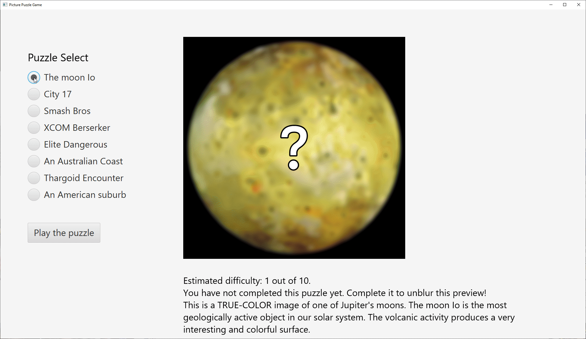

# Picture Puzzle High School JavaFX MP2 project

Picture Puzzle game created using **Java 11** and **JavaFX 11**. Built using **Maven**. Made for a high school marking period project. Standalone JAR in `./sample` confirmed to work on windows 10.

### To run project:
- Ensure you have at least Java 11 (verify with `java --version`)
- Download and double click [picturePuzzleJavaFX.jar](https://github.com/JLenander/BTHS-Java-Projects/blob/main/sample/picturePuzzleJavaFX.jar)
- Alternatively, via command line run `java -jar picturePuzzleJavaFX.jar` in the directory you downloaded the jar file in.

# Showcase GIFS:

### Main Menu

### Swap pieces to put the image back in order

### Satisfying win animation

## Build instructions
### (These are not user instructions but are self reminders.)

using OpenJDK version 11.0.9.1, Javafx version 11.0.2,
note that launcher class is required.
See [javafx docs link](https://openjfx.io/openjfx-docs/#modular) and [example of javafx maven build on github](https://github.com/openjfx/samples/tree/master/CommandLine/Non-modular/Maven) for more info

1. cd into directory `picturePuzzleJavaFX`
2. To run, `mvn clean javafx:run`
3. To make a jar file, `mvn compile package`
4. jar file under `picturePuzzleJavaFX/shade` is the one that includes the javafx packages.

Image Credit: Nasa, Valve, Nintendo, XCOM, Frontier, u/ryanchatfieldimages